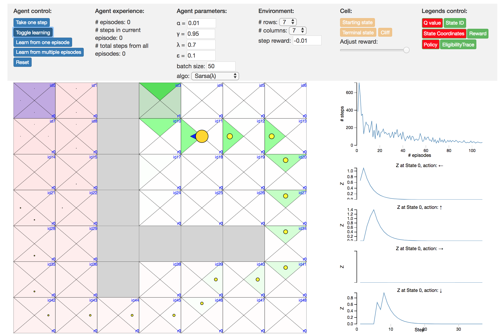

# RLjs

**RLjs** is forked from [REINFORCEjs](https://github.com/karpathy/reinforcejs)
by [Andrej Karpathy](http://cs.stanford.edu/people/karpathy/), but more
modualized with [React](https://facebook.github.io/react/)
in [ES2015/ES6](https://babeljs.io/learn-es2015/). It tries to serve mainly as a
playground for learning reinforcement learning (RL) related algorithms. The two
main parts are:

1. The agents as
   in
   [`src/lib/agents/`](https://github.com/zyxue/reinforcejs/tree/master/src/lib/agents),
   which implement key RL algorithms such as dynamic
   programming([Chapter 4](https://webdocs.cs.ualberta.ca/~sutton/book/ebook/node40.html)),
   Sarsa, Q-Learning
   ([Chapter 6](https://webdocs.cs.ualberta.ca/~sutton/book/ebook/node60.html),
   [Chapter 7](https://webdocs.cs.ualberta.ca/~sutton/book/ebook/node72.html)).
1. The grid world which is taken as the example to illustrate how different
   agents/RL algorithms work.

Currently, only tabular methods have been covered. Approximation methods are
planned to be developed developed in the future.

The draft app is available at https://rljs.herokuapp.com/.

There is also another repo for hosting machine-learning related notebooks I
created when learning/implementing algorithms at
https://github.com/zyxue/sutton-barto-rl-exercises.

A screenshot



## Setup

The development setup is adopted from
[create-react-app](https://github.com/facebookincubator/create-react-app).

```
git clone git@github.com:zyxue/rljs.git
cd rljs
yarn install
```

## Run server

```
yarn start
```

## Build
This will generate the static web site and copy it to the `docs` folder
that is deployed to the web site when you push to GitHub.

```
yarn build
```

## Test
```
yarn test
```
